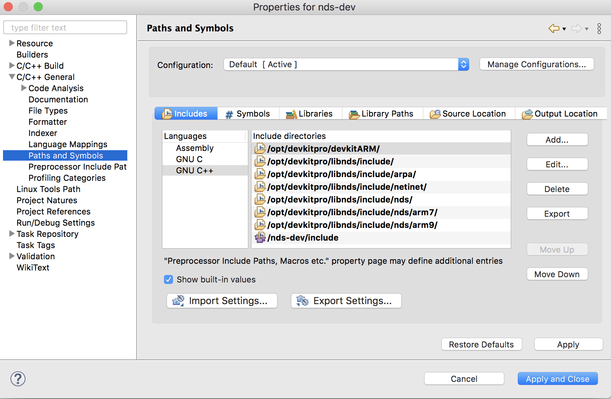
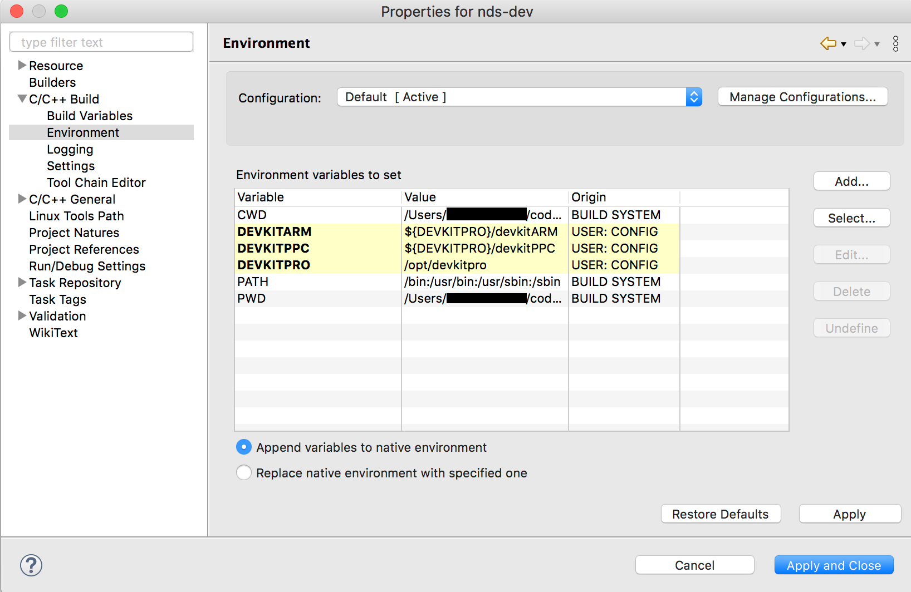
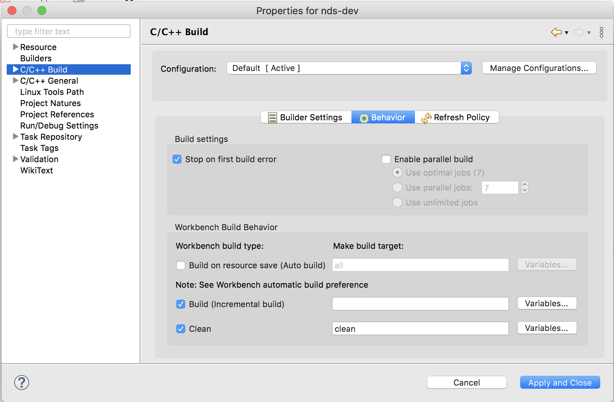
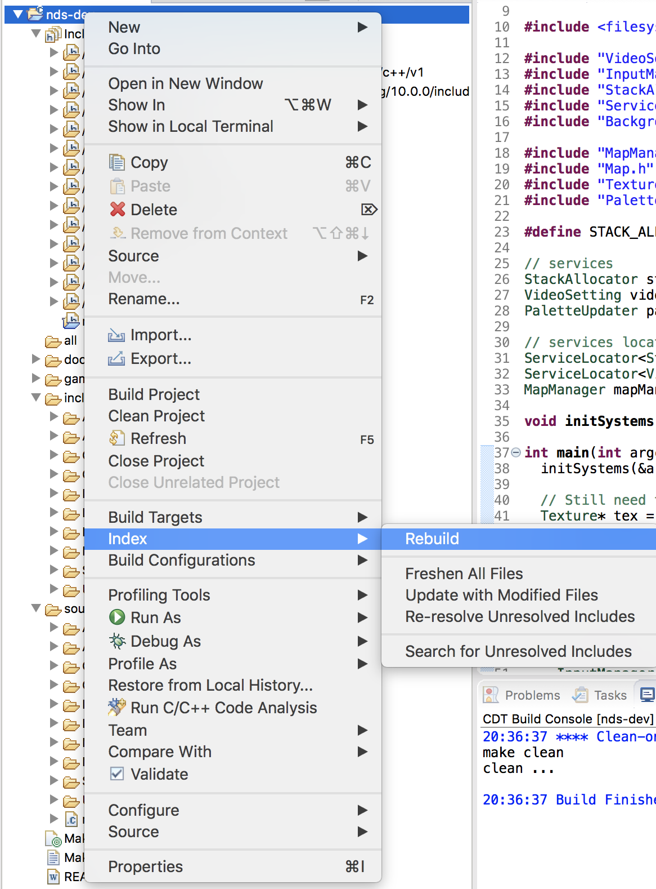

# IDE setup

I chose eclipse as my C/C++ IDE, but any other should work just fine. Here's the general idea of what you need to do:
 - Create/import a makefile based project
 - Use the standard `libnds` makefile
 - Set the includes path and environment
 - Make sure the build command is `make`
 - Modifiy your code to define `ARM9` or `ARM7` before including `nds.h`

## Project Creation

I started from an existing personal project, but you can start from one of the `libnds` example projects (located in `<your devkitpro installation>/examples/nds/`) that you copy to the location of your choice.

In Eclipse, navigate to `File` > `New` > `Makefile Project with Existing Code` and the chose the project folder.

## Includes

Navigate to the project `Properties` > `C/C++ General` > `Paths and Symbols` > `Includes`. In both `GNU C` and `GNU C++`, add all the includes folder from `libnds`/`devkitARM` and the include folder of your project (as a workspace path).



## Environment

Navigate to the project `Properties` > `C/C++ Build` > `Environment` to add the `DEVKITPRO`, `DEVKITARM` and `DEVKITPPC` variables. The values may differ depending on where your devkitpro installation is located.



## Build Settings
In my case, Eclipse used the `make all` command when building a makefile based project. The standard `libnds` makefile does not have a `make all` target so building the project would not work. I had to change to build command from `make all` to `make`.

To do so, navigate to the project `Properties` > `C/C++ Build` > `Behavior` and empty the `Build (Incremental Build)` field.




## Code Ajustment

Normally, including `<nds.h>` is all you need to do to have access to everything from `libnds`. Looking at the file, we see that it includes different headers depending on whether `ARM9` or `ARM7` is defined. Because none was defined in my code, Eclipse could not find a lot of things. To fix it, I defined `ARM9` at the top of my `main.cpp` file.

```
#ifndef ARM9
#define ARM9
#endif
```

The `libnds` provided `arm7` program is more than enough most needs, but if you decide to build your own, define `ARM7` in your `arm7` program before including `nds.h`.


## Makefile Adjustment

This is optional, but I changed the way the Makefile gets it's sources/includes to use `find`, in order to avoid updating the paths all the time.

```
#---------------------------------------------------------------------------------
# TARGET is the name of the output
# BUILD is the directory where object files & intermediate files will be placed
# SOURCES is a list of directories containing source code
# INCLUDES is a list of directories containing extra header files
# MAXMOD_SOUNDBANK contains a directory of music and sound effect files
#---------------------------------------------------------------------------------
TARGET    := $(shell basename $(CURDIR))
BUILD     := build
SOURCES   := $(shell find source -type d | tr '\n' ' ')
DATA      :=
INCLUDES  := $(shell find include -type d | tr '\n' ' ')
NITRODATA := game_data
```

## Troubleshooting
### Invalid Argument Type

After doing all of the above, eclipse showed some weird errors about invalid argument types. The errors disappeared after rebuilding the index. 

